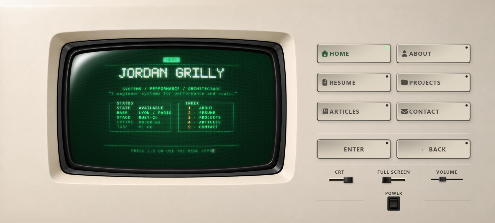
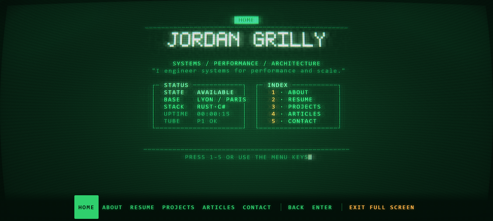

# Issue #13 — mobile landscape and fullscreen QA

Validated September 8, 2026, from `master` (`c0f6953`).

The previous wide-window desktop offset also applied to fullscreen: at
915 × 412 the entire glass started at y = 226.59px, leaving its softkeys below
the viewport. Fullscreen now starts at (0, 0), fills the available viewport,
and reserves the actual wrapped navigation height including safe-area padding.

The three supplied September 8 chassis PNGs replace the previous landscape
WebPs at their original dimensions. Their normalized alpha is preserved exactly;
the asset build measures the aperture and edge material directly. The fourth
image guides the larger CRT, thinner keys and distinct right-hand control tiers.
Desktop and portrait retain their existing composition.

## Validation

- Complete asset generation (`npm run assets`), production build, asset audit
  and runtime suite passed. Regenerating all sprites produced a byte-identical
  production bundle to the initially tested build.
- Full Playwright matrix: 172 scenarios, 82 passed, 89 intentionally skipped by
  the existing engine/device filters, and one mobile no-WebGL timeout during
  parallel execution. That scenario passed in isolation in 5.2 seconds.
- After the final short-phone label adjustment, all 20 targeted checks passed
  with one worker across Chromium, Firefox, WebKit and mobile Chromium. This
  reran the no-WebGL cases and all new landscape/fullscreen cases. Overall, all
  83 applicable scenarios were validated across the full and targeted runs.
- Verified all navigation/action keys remain separate and reachable, their text
  fits inside the faces, and touch keys retain 44px targets. Checked CSS and
  native fullscreen, exit focus, navigation, safe-area insets, portrait/landscape
  rotation, article reading position, media, CRT bypass and GPU failure fallback.
- Existing Axe checks passed on representative routes and fullscreen. The
  frontend static audit reported zero errors, warnings or unresolved findings;
  `git diff --check` passed.
- Browser captures showed the intended title and route, meaningful content,
  decoded frames and no Vite overlay or JavaScript errors. Chromium emitted
  driver `ReadPixels` performance warnings during captures.

The existing Playwright workflow was used because the BrowserAct CLI was not
available. Tests ran against the production preview at `http://127.0.0.1:4184`
using a temporary config with a dedicated port; screenshots used Vite at
`http://127.0.0.1:4183`. Desktop Firefox/WebKit touch emulation explicitly models
`maxTouchPoints`, since these desktop engines otherwise retain the host's zero
value despite emulating touch events and coarse-pointer CSS.

These are emulated devices on Windows, not a physical iPhone/Android test.
Safe-area scenarios use explicit inset values. CI owns Linux and Nginx checks.

## Screenshots

Captures use 2× pixel density and lossless WebP encoding; every converted pixel
was compared with the original PNG.

| CSS viewport | Evidence |
| --- | --- |
| 915 × 412, panoramic chassis | [Landscape](915x412.webp) |
| 667 × 375, 16:9 chassis | [Landscape](667x375.webp) |
| 740 × 480, 3:2 chassis | [Landscape](740x480.webp) |
| 568 × 280, short phone | [Complete key labels](568x280.webp) |
| 390 × 844, portrait | [Portrait regression](390x844.webp) |
| 915 × 412, fullscreen | [Viewport glass and softkeys](fullscreen-915x412.webp) |

